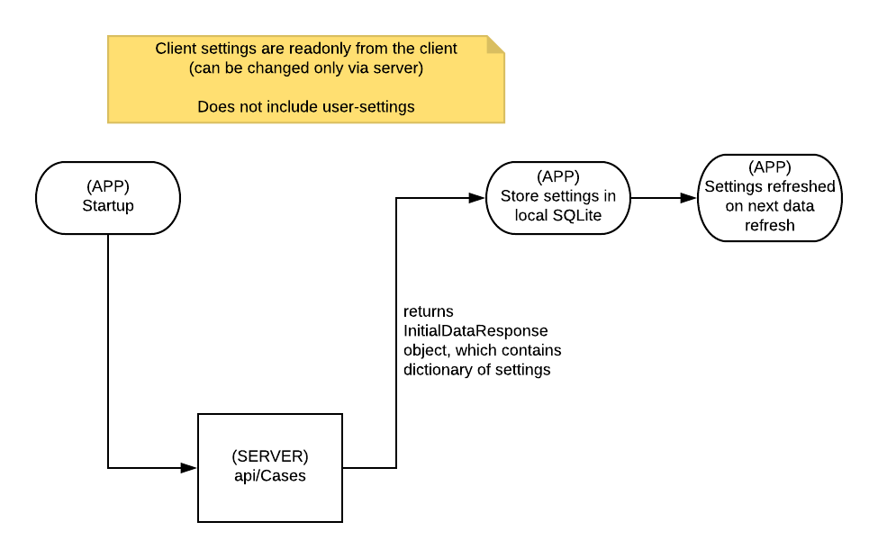

# Settings (Provider App & API)

## Overview

This does not include user settings.  Only application/client settings.

At some point we may refactor this... instead of calling `api/Cases` we may refactor to `api/GetInitialData` or some other more semantic means of initializing the application with server data.

These settings are read-only from the client.  They can be edited on the server end but cannot be updated by the client.

Mobile App settings are pulled from the server and cached locally.  On the server, they're typically listed as Web.config appSetting values, but may be pulled from other sources such as the database.

## API Setting Details

To find the setting details in the API project, look to `AABC.Mobile.Api.Providers.SettingsProvider`.  This will contain all of the settings used by the API and the client.  

## Mobile App Settings Details

Client-based settings are realized in the form of a KeyValuePair, as the key itself needs to be transferred to the mobile app.  Settings that are not part of the client are simple properties of the SettingsProvider class.

When the app starts and fetches it's initial data (via call to /Api/Cases), the `InitialDataResponse` of `GetCases()` contains the dictionary of settings that will be cached by the app.

The app caches these in it's SQLite database.

### Adding new Mobile App Settings

To add a new mobile app setting to be retrieved from the server, use the `Mobile.Api.Providers.SettingsProvider` class and it's associated interface.  Add a new KeyValuePair property accordingly, and be sure to add the new setting to the `AllClientAppSettings` property of the class so it's returned to the client.